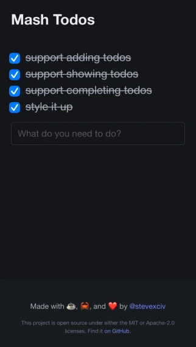

# MASH Stack TODO App



A simple example application (TODO list) built on the MASH stack.

I blogged about building this app [here](https://www.stevexciv.com/blog/zero-to-prototype-trying-out-the-mash-stack/)!

Want even more? Check out a couple of other great resources on the MASH stack:

- A [homepage](https://yree.io/mash/) for the MASH stack by [Shantanu Mishra](https://github.com/8hantanu)
- A [blog post](https://emschwartz.me/building-a-fast-website-with-the-mash-stack-in-rust/) about the stack by [Evan Schwartz](https://github.com/emschwartz/)

## Running

You'll need the Cargo build tool. It's part of the Rust toolchain.
The best way to get it is via [rustup.rs](https://rustup.rs/).

Clone the repository using your Git interface of choice, then navigate to the
project directory and run with:

```
cargo run
```

This will serve the application on http://127.0.0.1:3000 by default.

This can be configured via command line arguments or environment variables.

Run with the `-h`/`--help` flag for complete instructions:

```
cargo run -- --help
```

Optionally include a `.env` file in the working directory to specify env vars.

### Compatibility Notes

I have personally tested this app on Firefox and Chromium and have had no noticable issues.
Testing was done on an `x86_64` machine running Fedora Linux and an M1 Mac running macOS Sequoia.
I don't own a Windows machine so YMMV on that platform.
If anyone reading this has had success running on Windows please let me know and I'll update the notes.

## Repository Structure

You'll see a `db/.gitkeep` file at the top of the directory; this is there to force the
directory to exist on a fresh clone.
Anything else in `db/` will be ignored; the application stores its SQLite database file here.

The `migrations/` directory contains the SQL code to build the database from scratch.
The application embeds the migrations automatically so they don't need to be manually run.
If you're interested in knowing more, check out the [SQLx CLI tool](https://github.com/launchbadge/sqlx/tree/main/sqlx-cli).

The `public/` directory contains vendored front-end libraries (htmx and Bulma at the moment), as well as some minor CSS tweaks I wrote.
The htmx docs link to [a good writeup](https://blog.wesleyac.com/posts/why-not-javascript-cdn) on reasons to reconsider CDNs.
I specifically chose to forego a CDN distribution to test MASH stack's ergonomics in this area.

The Rust source code is all under `src/`.
There aren't many files, so if you'd just prefer to read the code, feel free to dive right in.
Otherwise, here's a lightning round tour:

- `db.rs`: bootstraps the database connection pool and ensures migrations are run
- `main.rs`: entrypoint; pulls together all the dependencies and runs the server
- `routes.rs`: axum router; tells the server which HTTP requests go where
- `state.rs`: app state struct; nothing special here as it just wraps the DB connection pool
- `todos.rs`: data types and DAO methods for the `Todo`, the primary (and only) domain object
- `views.rs`: these are the route handlers; they convert requests into responses, which are HTML strings

## License

Either of:

- [MIT](./LICENSE-MIT)
- [Apache 2.0](./LICENSE-Apache)

at your choosing.
